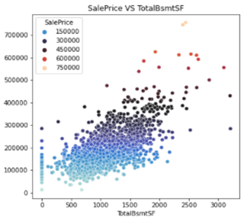
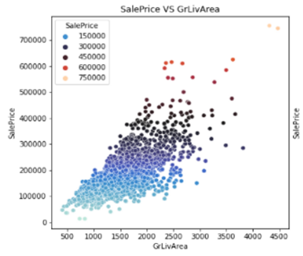
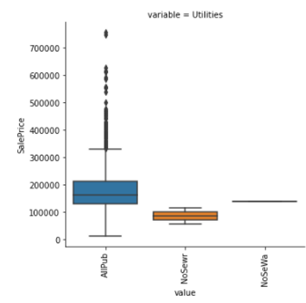

# House Price Prediction 
The purpose of this project is to predict sale price for houses in the future, by using historical house sales data. Create two regression models and select the best one.

## Dataset Source  [Kaggle Link](https://www.kaggle.com/c/house-prices-advanced-regression-techniques)
The data provided has 20,510 observations and 82 fields. ‘SalePrice’ is our dependent variable. Each observation is the purchase data of one property – It describes various features of the house, year built, year sold, etc. The data has 39 integer variables such as SalePrice, LotArea, PoolArea, and 43 categorical variables such as HouseStyle, Street, Alley, LotShape, etc. 

## Project Overview 
The analysis consists of 1 Jupyter notebooks.
1. Exploratory Data Analysis +  Machine Learning Modeling. The detailed notebook of modeling can be found. The detailed notebook of EDA can be found <a href="https://github.com/akhil-awari/Akhil_Github/blob/main/House%20Price%20Prediction/House_price_pred.ipynb">here</a>.

See the <a href="https://github.com/akhil-awari/Akhil_Github/blob/main/House%20Price%20Prediction/House_price_pred.pptx">presentation slides</a> for a summary of this analysis.

Machine Learning Models Used: 
1. Linear Regression (Lasso, Ridge)
2. Random Forest

## Final Models Selected:

I have selected 2 models for this assignment:

1.Linear Regression Model – R-square of 0.847 and MSE of 0.0181

- Multiple columns in the data are linearly correlated with Sale Price
- Easy to predict house price as we need only a set of coefficients

2.Random Forest Model – R-square of 0.857 and MSE of 0.017

- Powerful Ensemble method that uses multiple Binary trees
- Better accuracy in price predicting compared to Linear Regression Model

Summary of Insights drawn from the final model:

- Top 10 features that **increase** the sales price of a house for **Model 1** are:

- Top 10 **important** features for predicting Sale Price of a house for **Model 2** are:

Exploratory Data Analysis:

**Checking for Missing values:** There are 27 features with missing values, out of which 5 features have more than 45% missing values. Below is the table containing the top 10 missing value columns.

| **S.No** | **Feature** | **% Missing Data** |
| --- | --- | --- |
| 1 | PoolQC | 99.56% |
| 2 | MiscFeature | 96.38% |
| 3 | Alley | 93.24% |
| 4 | Fence | 80.48% |
| 5 | FireplaceQu | 48.53% |
| 6 | LotFrontage | 16.72% |
| 7 | GarageYrBlt | 5.43% |
| 8 | GarageFinish | 5.43% |
| 9 | GarageQual | 5.43% |
| 10 | GarageCond | 5.43% |

**Handling Missing values:**
Although there are columns with more than 80% missing values, instead of simply dropping them, I further explored the data to check if the missing values impacted Sale Price.

 

To my surprise, missing values indeed had a significant impact on the Sale Price. For example, the average sale price of houses with missing 'Total Basement Area' variable is significantly low when compared to the average Sale Price for Non-Null values.

_ **Assumption 1: When a certain feature is missing in a property, it was left blank during data collection. Hence, we can impute zero to certain missing numeric features and 'None' to categorical features as a new category.** _

Plotted a line graph for variable 'YrSold' vs. Median 'SalePrice' to see if there is any relation between them.

The average price decreased significantly after 2007 and this could be due to the housing bubble crash.

_ **Assumption 2: 'YrSold' has a significant impact on Sale Price as seen from the above graph. There are only 5 different values in the 'YrSold' variable. Hence, I'm considering this as a Categorical variable** _

**Feature Engineering:**

In my further data exploration, I created three new variables: Age of the house, Age of remodeling and Age of garage built. Below are the scatter plots between Sale Price and these new variables.

 

_ **Assumption 3: From the third plot above there is a data point that has 'Age of garage built' as -200, which does not make any sense. I assumed this entire row to be noise and dropped this row from my analysis.** _

I plotted scatter plots between all numeric variables vs. Sale Price and noticed some interesting patterns.

   

**Many input variables are linearly dependent on Sale Price. Hence, it is a good start to consider linear modeling for this problem**. Some insights from the data are:

- New properties are more expensive than old properties
- 'GrLivArea' (Ground living area) has a direct correlation with the price of the property
- Total Basement Area, which is linearly related with the total living area, also is directly proportional to the price of the property.
- 'MoSold' (Month Sold) has no effect on the price

I plotted box plots for all the categorical variables and identified a few interesting patterns

 

 

From all the boxplots above, I observed that many categorical variables have a remarkable relation with Sale Price. Also, there are some outliers for both numerical and categorical features which are handled in feature engineering. Below are the insights:

- Properties with a 'Paved Alley' demand a higher price
- Houses where the Basement Quality is good or excellent are sold at higher prices compared to the rest
- Houses with good and excellent garages are sold at higher prices
- Houses with good quality kitchens also impact the price in a positive way

**Multicollinearity** is one of the biggest problems with linear regression and I suspect few independent variables to have a significant correlation. To inspect this, I plotted a heat map to get a better sense

I observed that few independent variables are correlated with a correlation factor as high as 0.85. Only one column among the two correlated columns needs to be dropped and I dropped all columns with correlation factor \> 0.6 from the upper triangle of the correlation matrix.

_ **Assumption 4: I have considered a correlation factor of 0.6 as the threshold to handle multicollinearity problems. I dropped upper triangle columns from the correlation matrix with values out of the threshold bound after feature engineering.** _

Based on my Assumption 1, I imputed missing values as 'None' for categorical variables and '0' for the numeric variables - 'MasVnrArea', 'TotalBsmtSF', 'BsmtUnfSF', 'BsmtFinSF1', 'BsmtFinSF2'.

For the numeric variable 'LotFrontage' which has 18% missing data, I imputed the Median value instead of '0' because imputing zero would further increase skewness.

**Further Feature Engineering:**

I observed some columns have above 99% same values. Thus, it does not play any part in predicting the target variables. 'Street', 'Utilities', 'Condition2', 'PoolArea', 'PoolQC' are these features.

_**Assumption 5: I considered 99% as the threshold value for dropping columns that have the same values. But among the listed features above there is a significant impact of the 'Condition2' variable and 'PoolQC' variable on SalePrice (can be seen from the above bar plots). Hence, I did not drop these columns.**_

**Removing Outliers:** From the scatterplots, I observed that variables 'GrLivArea', 'GarageArea', 'TotalBsmtSF', 'LotArea' have outliers. Hence, I built a function to identify points that fall outside the interquartile range and dropped those rows. 4 outliers have been detected and removed.

I grouped some existing features and created four new features.

1. 'YrBltAndRemod' - Created this feature by adding Year Built and Year remodified

Intuition behind this is, I observed from the scatterplots that remodeled age \> 100 have high prices. This could be due to the demand for remodeled vintage houses

1. 'Total\_sqr\_footage' - Created this feature by adding all floors and basement area

It is better to have one single column rather than 4 columns

1. 'Total Bathrooms' - Created a derived column for the total number of bathrooms
2. 'Total\_porch\_sf' - Created this by adding all porch areas in square feet

**Log Transformation:** I plotted the distribution of Sale Price and identified that it is right-skewed. Hence I used log transformation to make this target variable follow a normal-like distribution.

_ **Assumption 6: The transformed Sale Price variable follows a Normal Distribution** _

**Data Split:** Sale Price is dependent on 'YrSold' (Year Sold). We want to build a model that can tackle a future data point for 'YrSold' (not inside the model). Hence, it would be better to split data with years

I used around 88% of the data for the train dataset and 12% for the test dataset by using this split i.e 2006 to 2009 for training and 2010 for test.

**Model Selection:**

I selected Linear regression as my first model. A lot of columns in our data are linearly dependent on the 'SalePrice' column. I applied Lasso and Ridge regularization methods and used GridSearchCV to find optimal alpha value.

I used the Variance inflation factor technique to handle multicollinearity problems where all columns with VIF\>10 are dropped from the training dataset. Although the Ridge model gave a better R-squared and MSE, I chose Lasso because it can reduce a coefficient to zero. Hence, rejecting insignificant variables. Below are the results for the final Lasso model.

I chose the Random Forest model as the second model. This ensemble model uses Bootstrap aggregating to reduce variance without affecting bias. I used GridsearchCV to find the optimal set of hyperparameters that will reduce overfitting. Below are the results for my RandomForest model.

Random Forest model is more powerful than the linear regression model. But the linear regression model is easy to interpret as we only need a set of coefficients to predict house price. There is more scope for hyperparameter tuning for Random Forest model and better R-squared and MSE can be achieved.

**Multiple Factor Analysis:**

To improve the model's performance we explored dimension reduction techniques, first we tried PCA, but after considering professor's suggestions, we changed PCA to multi factor analysis.

After Feature Engineering and One Hot Encoding we had more than 250 columns of data, our multi factor analysis model reduced this to 11 columns with an R-squared of 0.60. Although this is quite small compared to all the above models, it depends on the audience's choice on which model to usel.

If the model is used just for reference, it makes sense to use a simple model which is computationally more efficient. But if the primary goal is to build a robust model, using ensemble methods or deep learning techniques will yield a better model.

###### This document is created by Akhil Awari
